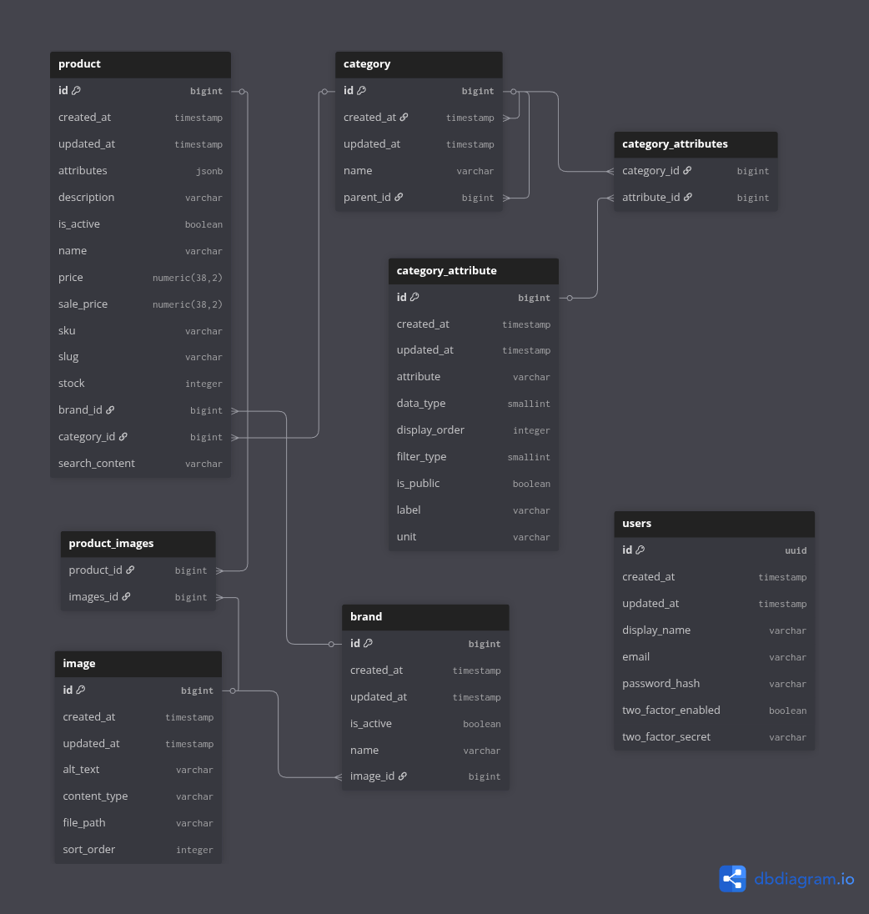

## Shopping app backend


- [Requirements](#requirements)
- [Tech stack](#tech-stack)
- [Project overview](#project-overview)
- [Entity Relationship Diagram](#entity-relationship-diagram)
- [Setup](#setup)
- [Configuration](#configuration)
- [API](#api)

## Requirements

- Docker


## Tech stack

- **Containerization**: Docker
- **Language**: Kotlin 2.0.20
- **Framework**: Spring Boot 3.5.6
- **Build tool**: Gradle
- **Database**: PostgreSQL 18
- **Cache / store**: Redis
- **Auth**:
  - JWT via `jjwt`
  - Spring Security OAuth2 client (Google)
  - 2FA (TOTP) via `dev.samstevens.totp`

## Project overview


Backend for an e‑commerce catalogue focused on selling car tyres, 
but can support a wide range of products.

It provides:

#### Product catalogue

- Products with schemaless **PostgreSQL**'s jsonb attribute model.
- Categories with attributes for providing filters/facets, stored in an EAV model.
- Images for products and brands.

#### Authentication & security


- Registration with **Captcha** (Cloudflare Turnstile) integration and login 
via **email/password** or **OAuth2** (Google)

- **JWT** access tokens in Authorization header + refresh tokens in HTTP‑only cookie. Both are almost
 stateless with token versioning implemented in **Redis** for token revocation on demand

- Optional user enabled **Two‑factor authentication (2FA)**

- Password reset with email verification

- Spring Security–based configuration and route protection


#### Infrastructure & tooling


- PostgreSQL as the primary database
- Redis for caching / token versioning
- Database seeding via `DatabaseInitializer` for product catalogue
- Email sending via SMTP (Spring Mail)
- Cloudflare Turnstile CAPTCHA integration
- dev.samstevens.totp to generate and validate TOTP codes for 2FA.

The backend is designed to sit behind a separate frontend which is going to be implemented
in the next task and exposes its API under `/api/v1/**`.


### Entity Relationship Diagram




### Setup
#### 1. Clone the repository

```
git clone https://gitea.kood.tech/romangadjak/i-love-shopping1.git dot-com-retail
cd dot-com-retail
```


#### 2. Configure environment variables / secrets

Copy the contents of `sample.env` to `.env` and edit them there

#### Image storage
 - `UPLOAD_PATH`

Default should work.

**JWT**
  - `JWT_SECRET` - already pre-defined

**OAuth2**
  - `GOOGLE_CLIENT_ID`
  - `GOOGLE_CLIENT_SECRET`

This is used for authentication via Google's OAuth2. Can be be skipped if you want.

**Mail**
  - `MAIL_USERNAME` Gmail username
  - `MAIL_PASSWORD` Gmail password

This is used only for sending password reset emails, so you can skip it if you want.
You can't use your real password. Google requires you to enable 2FA and generate a separate password.

**Cloudflare Turnstile (captcha)**
  - `TURNSTILE_SECRET_KEY`

Captcha is only used for registering new user accounts.
You can skip this if you want, the .env file contains 2 dummy keys:

1) always pass
2) always fail

#### docker compose

You can edit environment variables per container for PostgresSQL and Redis in `docker-compose-dev.yml` and the backend in `docker-compose.yml`


#### 3. Build and run the container
```
docker compose up
```

#### For development run only Postgres and Redis

``docker compose -f docker-compose-dev.yml up -d``

And backend
``./gradlew bootRun``

or from your IDE (import the ``.env`` file)

Spring starts on **port 8080** by default.


#### Stopping
``docker compose down``

#### 4. Build and run the backend

From the `backend` directory:

```bash
cd backend
./gradlew clean build
./gradlew bootRun
```


### Endpoints

[Endpoints](./endpoints.md)


### File storage

Configured under `file.*` properties in `application.yml`:

- Base uploads directory: `{UPLOAD_PATH}`, calculated at runtime to support different environments
- Product images: `${uploads}/images/product`
- Brand images: `${uploads}/images/brand`

