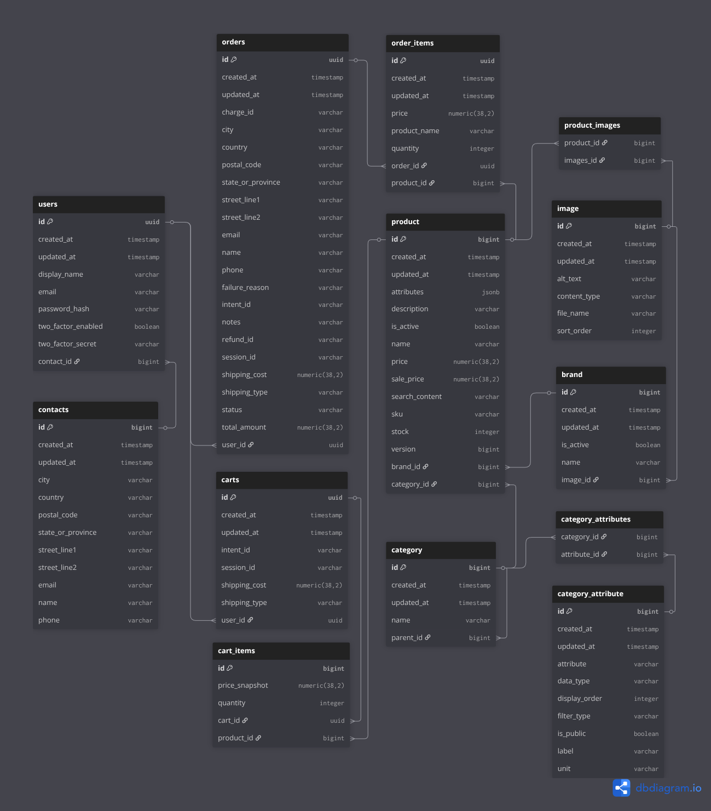

## Shopping app backend


- [Requirements](#requirements)
- [Tech stack](#tech-stack)
- [Project overview](#project-overview)
- [Entity Relationship Diagram](#entity-relationship-diagram)
- [Setup](#setup)
- [Endpoints](./endpoints.md)
- [File storage](#file-storage)


## Tech stack

### Backend

|                       |                   |
|-----------------------|-------------------|
| Language              | Kotlin 2.0.20     |
| Framework             | Spring Boot 3.5.6 |
| Build tool            | Gradle            |
| Database              | PostgreSQL 18     |
| Cache / session store | Redis             |
| Message broker        | RabbitMQ          |
| Payments              | Stripe            |
| Containerization      | Docker            |

### Frontend
|                 |                         |
|-----------------|-------------------------|
| Framework       | Next.js 15 (App Router) |
| Language        | TypeScript              |
| Styling         | Tailwind CSS            |
| Package manager | pnpm                    |

## Project overview


Backend for an e‑commerce catalogue focused on selling car tyres, 
but can support a wide range of products.

It provides:

### Product catalogue

- Products with schemaless **PostgreSQL**'s jsonb attribute model.
- Categories with attributes for providing filters/facets, stored in an EAV model.
- Images for products and brands.

### Cart
- Guest cart identified by a `X-Session-Id` header, persisted temporarily in the database
- Persistent cart for logged-in users, retained across sessions
- Real-time total calculations including shipping cost
- Pessimistic locking on cart reads to prevent race conditions at checkout
- Stock validation on every cart interaction

### Checkout & payments
- Single-page checkout collecting contact details, shipping address, and shipping type
- Stripe Elements for PCI-compliant card input — no card data touches the server
- Contact details are encrypted on rest
- Payment related functionality is moved to a RabbitMQ message queue.
- Abandoned orders (stuck in `PENDING_PAYMENT` for over 1 hour) are automatically cancelled by a scheduled cleanup job

### Email notifications
- Password reset
- Order confirmation and refunds
- Emails are sent asynchronously

### Concurrency & stock
- Optimistic locking on products to prevent overselling
- If two payments succeed for the last item simultaneously, the second order is automatically refunded and cancelled

### Admin functionality

- Full CRUD over products, categories, orders, and refunds.
- Manual shipping status updates and delivery option management.
- User account management with role-based access control (admin, support, sales).
- Bulk product data upload via JSON or CSV.
- Review moderation — approve, edit, or remove user reviews.
- All admin accounts require 2FA to be active.

### Authentication & security

- Registration with **Cloudflare Turnstile** CAPTCHA and login 
via **email/password** or **OAuth2** (Google)

- **JWT** access tokens in Authorization header + refresh tokens in HTTP‑only cookie. Both are almost
 stateless with token versioning implemented in **Redis** for token revocation on demand

- Optional user enabled **Two‑factor authentication (2FA)**

- Password reset with email verification

- Spring Security–based configuration and route protection

- Self-signed TLS certificate

- Token bucket **rate limiting** on sensitive endpoints.

- All sensitive data encrypted

### Entity Relationship Diagram



## Setup

### Requirements
- Docker
- [Stripe CLI](https://stripe.com/docs/stripe-cli) (for local payment simulation)


### 1. Clone the repository

```
git clone https://gitea.kood.tech/romangadjak/i-love-shopping1.git dot-com-retail
cd dot-com-retail
```


### 2. Configure environment variables / secrets

Copy `sample.env` to `.env` and fill in the values:

```bash
cp sample.env .env
```

| Variable                | Required | Description                                                                                                                                                 |
|-------------------------|----------|-------------------------------------------------------------------------------------------------------------------------------------------------------------|
| `UPLOAD_PATH`           | No       | File upload directory. Default works out of the box.                                                                                                        |
| `JWT_SECRET`            | No       | Pre-defined in sample.env.                                                                                                                                  |
| `GOOGLE_CLIENT_ID`      | No       | OAuth2 login via Google.                                                                                                                                    |
| `GOOGLE_CLIENT_SECRET`  | No       | OAuth2 login via Google.                                                                                                                                    |
| `MAIL_USERNAME`         | No       | Gmail address for sending emails.                                                                                                                           |
| `MAIL_PASSWORD`         | No       | Gmail [app password](https://support.google.com/accounts/answer/185833). Your regular password won't work — Google requires 2FA + a generated app password. |
| `TURNSTILE_SECRET_KEY`  | No       | Cloudflare Turnstile CAPTCHA for registration. `sample.env` includes dummy keys that always pass or always fail.                                            |
| `STRIPE_SECRET_KEY`     | No       | Stripe secret key from your [Stripe dashboard](https://dashboard.stripe.com/apikeys).                                                                       |
| `STRIPE_WEBHOOK_SECRET` | No       | Webhook signing secret. Run `stripe listen --forward-to localhost:8080/api/v1/payment/webhook/stripe` to get it during development.                         |

For frontend copy `.env.example` to `.env.local`:

```bash
cp sample.env .env
```

| Variable                             | Required | Description                                                                                 |
|--------------------------------------|----------|---------------------------------------------------------------------------------------------|
| `NEXT_PUBLIC_TURNSTILE_SITE_KEY`     | No       | Cloudflare Turnstile CAPTCHA for registration. Contains dummy keys that always pass or fail |
| `NEXT_PUBLIC_STRIPE_PUBLISHABLE_KEY` | No       | Stripe publishable key from Stripe dashboard                                                |

### Run with Docker

### 3. Build and run the container
```
docker compose up
```

Both frontend and backend are accessible at https://localhost/

#### For development run only Postgres, Redis and RabbitMQ in docker

``docker compose -f docker-compose-dev.yml up -d``

Then backend and frontend

``./gradlew bootRun``

```
cd frontend
pnpm dev
```

Spring starts on **port 8080**, Next.js on **port 3000** by default.

### 4. Stripe webhook

Install the [Stripe CLI](https://stripe.com/docs/stripe-cli) and forward events to your local server:

```bash
stripe listen --forward-to localhost:8080/api/v1/payment/webhook/stripe
```

Copy the webhook signing secret it outputs into your `.env` as `STRIPE_WEBHOOK_SECRET`.


### Stopping
``docker compose down``


## File storage

Configured under `file.*` in `application.yml`:

| Path                           | Contents       |
|--------------------------------|----------------|
| `{UPLOAD_PATH}/images/product` | Product images |
| `{UPLOAD_PATH}/images/brand`   | Brand images   |
 
---

## Testing

### Unit tests

- **Product data model** — validates data structure and field constraints.
- **Cart functionality** — item management, quantity updates, and total calculations.
- **Order summary calculations** — pricing, discounts, and shipping cost accuracy.
- **JWT token handling** — generation, validation, and expiration behaviour.
- **User input validation** — correct handling of valid and invalid input scenarios.

### API integration tests

- **Endpoints** — correct responses and error handling for all routes.
- **Database operations** — data persistence and retrieval across the full stack.

### Critical user flow tests

- **Product search** — accurate and performant search results.

### Security tests

- **Rate limiting** — verification that the token bucket mechanism prevents abuse under repeated requests.

### Load testing

Three scenarios designed to mimic real user behaviour and exact requests that happen:

1. Browsing product catalogues and category pages as a guest.
2. Searching for products, applying filters and adding items to the cart logged in.
3. Adding items to the cart and completing checkout.

All tests passed easily with minimum requirements.

Stress testing shows that at around 1000 concurrent users browsing the site is enough to saturate my system.
Main bottleneck right now is the frontend.

```
         /\      Grafana   /‾‾/
    /\  /  \     |\  __   /  /
   /  \/    \    | |/ /  /   ‾‾\
  /          \   |   (  |  (‾)  |
 / __________ \  |_|\_\  \_____/


     execution: local
        script: loadtest/browse_guest.js
        output: -

     scenarios: (100.00%) 1 scenario, 1000 max VUs, 2m30s max duration (incl. graceful stop):
              * default: Up to 1000 looping VUs for 2m0s over 3 stages (gracefulRampDown: 30s, gracefulStop: 30s)


  █ THRESHOLDS

    http_req_duration
    ✓ 'p(90)<2000' p(90)=465.9ms

      {layer:api}
      ✓ 'p(90)<2000' p(90)=224.8ms

      {layer:ssr}
      ✓ 'p(90)<2000' p(90)=577.35ms

    http_req_failed
    ✓ 'rate<0.02' rate=0.00%

      {layer:api}
      ✓ 'rate<0.02' rate=0.00%

      {layer:ssr}
      ✓ 'rate<0.02' rate=0.00%


  █ TOTAL RESULTS

    checks_total.......: 44350   316.743243/s
    checks_succeeded...: 100.00% 44350 out of 44350
    checks_failed......: 0.00%   0 out of 44350

    ✓ home page 200
    ✓ refresh responded
    ✓ featured products 200
    ✓ browse page 200
    ✓ filters 200
    ✓ filter 1 applied 200
    ✓ filter 2 applied 200
    ✓ filter 3 applied 200
    ✓ product page 200
    ✓ reviews 200

    HTTP
    http_req_duration..............: avg=158.66ms min=519.99µs med=38.84ms max=6.33s  p(90)=465.9ms  p(95)=659ms
      { expected_response:true }...: avg=158.66ms min=519.99µs med=38.84ms max=6.33s  p(90)=465.9ms  p(95)=659ms
      { layer:api }................: avg=80.12ms  min=667.41µs med=30.63ms max=1.73s  p(90)=224.8ms  p(95)=307.32ms
      { layer:ssr }................: avg=211.02ms min=519.99µs med=43.58ms max=6.33s  p(90)=577.35ms p(95)=728.17ms
    http_req_failed................: 0.00%  0 out of 44350
      { layer:api }................: 0.00%  0 out of 17740
      { layer:ssr }................: 0.00%  0 out of 26610
    http_reqs......................: 44350  316.743243/s

    EXECUTION
    iteration_duration.............: avg=19.11s   min=12.51s   med=18.81s  max=30.79s p(90)=21.97s   p(95)=23.39s
    iterations.....................: 4435   31.674324/s
    vus............................: 1      min=1          max=1000
    vus_max........................: 1000   min=1000       max=1000

    NETWORK
    data_received..................: 820 MB 5.9 MB/s
    data_sent......................: 4.6 MB 33 kB/s


running (2m20.0s), 0000/1000 VUs, 4435 complete and 0 interrupted iterations
default ✓ [======================================] 0000/1000 VUs  2m0s
```

## Endpoints

See [endpoints.md](./endpoints.md) for the full API reference.

